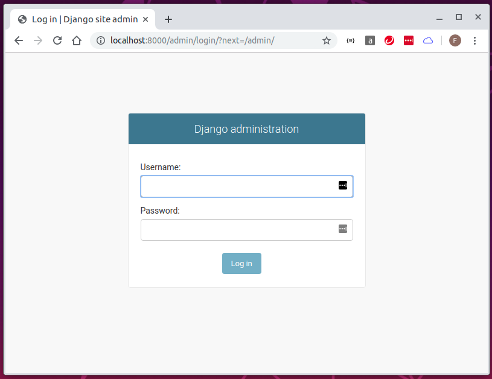
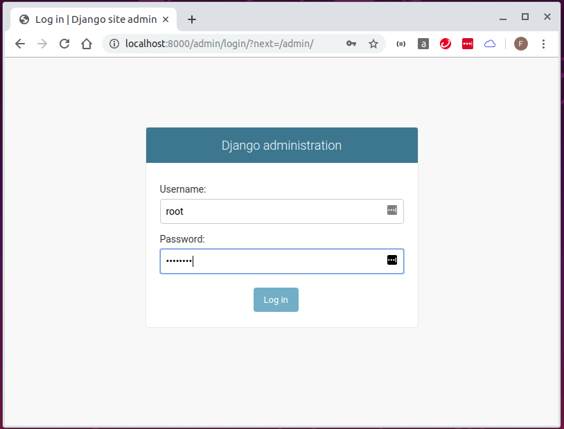
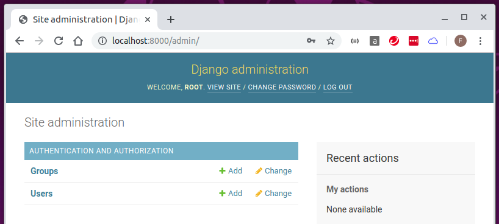

# migrate admin database and create super user

## migrate admin database

```
feng@ubuntu:~/docker-django-v2$ sudo docker-compose run web python manage.py migrate
[sudo] password for feng: 
Creating network "docker-django-v2_backend" with the default driver
Creating docker-django-v2_db_1 ... done
Operations to perform:
  Apply all migrations: admin, auth, contenttypes, sessions
Running migrations:
  Applying contenttypes.0001_initial... OK
  Applying auth.0001_initial... OK
  Applying admin.0001_initial... OK
  Applying admin.0002_logentry_remove_auto_add... OK
  Applying admin.0003_logentry_add_action_flag_choices... OK
  Applying contenttypes.0002_remove_content_type_name... OK
  Applying auth.0002_alter_permission_name_max_length... OK
  Applying auth.0003_alter_user_email_max_length... OK
  Applying auth.0004_alter_user_username_opts... OK
  Applying auth.0005_alter_user_last_login_null... OK
  Applying auth.0006_require_contenttypes_0002... OK
  Applying auth.0007_alter_validators_add_error_messages... OK
  Applying auth.0008_alter_user_username_max_length... OK
  Applying auth.0009_alter_user_last_name_max_length... OK
  Applying auth.0010_alter_group_name_max_length... OK
  Applying auth.0011_update_proxy_permissions... OK
  Applying sessions.0001_initial... OK
feng@ubuntu:~/docker-django-v2$ 

feng@ubuntu:~/docker-django-v2$ sudo docker-compose run web python manage.py createsuperuser
Starting docker-django-v2_db_1 ... done
Username (leave blank to use 'root'): 
Email address: lifcn@yahoo.com
Password: password
Password (again): password
This password is too common.
Bypass password validation and create user anyway? [y/N]: y
Superuser created successfully.
feng@ubuntu:~/docker-django-v2$ 
```

## test admin

```
feng@ubuntu:~/docker-django-v2$ docker-compose up -d --build
Creating network "docker-django-v2_backend" with the default driver
Building web
Step 1/7 : FROM python:3.7.3
 ---> 34a518642c76
Step 2/7 : ENV PYTHONUNBUFFERED 1
 ---> Using cache
 ---> 8c3e96d4dd5b
Step 3/7 : RUN mkdir /code
 ---> Using cache
 ---> b779f7885af3
Step 4/7 : WORKDIR /code
 ---> Using cache
 ---> f72f686dfb8a
Step 5/7 : COPY requirements.txt /code/
 ---> Using cache
 ---> b3d946592548
Step 6/7 : RUN pip install -r requirements.txt
 ---> Using cache
 ---> 34a1981df8c1
Step 7/7 : COPY . /code/
 ---> 2ec8cf5f5a02
Successfully built 2ec8cf5f5a02
Successfully tagged docker-django-v2_web:latest
Creating docker-django-v2_db_1 ... done
Creating docker-django-v2_web_1 ... done
feng@ubuntu:~/docker-django-v2$ 
```

* test-01: http://localhost:8000/admin



* test-02: http://localhost:8000/admin



* test-03: http://localhost:8000/admin


